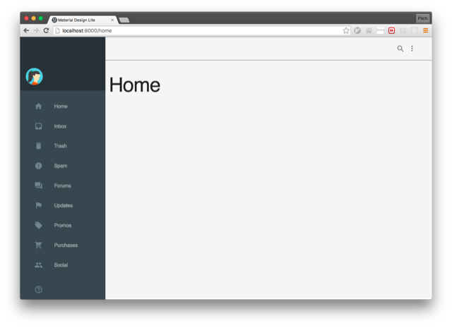

## Angular Template

- Angular2 + Router
- JSPM
- Material Design Lite



## Issue

### moduleResolution = "node"

TypeScript ยังไม่สามารถโหลด module จาก jspm_packages ได้โดยตรง ต้องติดตั้ง module ซ้ำไปที่ node_modules

### GET http://localhost:8000/crypto.js 404 (File not found)

ให้ติดตั้ง crypto ด้วย jspm

```
jspm install crypto
```